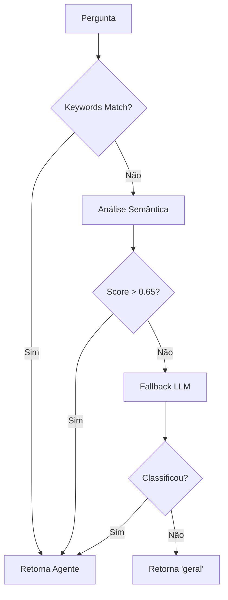

# 🤖 Classificação Híbrida de Subagentes - Neoson

## **Visão Geral**

Implementamos uma abordagem híbrida para classificação inteligente de perguntas no sistema Neoson, combinando:

1. **Busca rápida por keywords** (determinística e eficiente)
2. **Análise semântica com embeddings** (contextual e flexível)  
3. **Fallback com LLM** (para casos complexos)

## **Arquitetura da Solução**

### **Fase 1: Keywords (Busca Rápida)**
```python
keywords_mapping = {
    'rh': ['férias', 'benefícios', 'salário', 'contrato', 'home office'],
    'ti': ['senha', 'VPN', 'servidor', 'backup', 'segurança', 'sistema']
}
```

- ✅ **Vantagem**: Instantâneo, sem custo de API
- ✅ **Uso**: Casos óbvios com termos específicos
- ❌ **Limitação**: Não entende sinônimos ou contexto

### **Fase 2: Embeddings (Análise Semântica)**
```python
def _classificar_com_embeddings(self, pergunta: str) -> str:
    pergunta_embedding = self.embeddings.embed_query(pergunta)
    
    for agente_key in agentes_unicos:
        texto_agente = f"{descricao}. Palavras-chave: {keywords}"
        agente_embedding = self.embeddings.embed_query(texto_agente)
        score = cosine_similarity(pergunta_embedding, agente_embedding)
```

- ✅ **Vantagem**: Entende contexto, sinônimos e nuances
- ✅ **Uso**: "trabalhar remotamente" → RH (home office)
- ❌ **Limitação**: Mais lento, consome tokens

### **Fase 3: LLM Fallback**
```python
def _classificar_com_llm(self, pergunta: str) -> str:
    prompt = f"Classifique: {pergunta}"
    return llm.invoke(prompt)
```

- ✅ **Vantagem**: Pode lidar com casos muito complexos
- ❌ **Limitação**: Mais lento e custoso

## **Fluxo de Decisão**



## **Configurações dos Agentes**

### **Para o Generate Subagent**

**Keywords**: Termos específicos e técnicos
```python
keywords=["orcamento", "budget", "custos", "despesas", "ROI", "P&L"]
```

**Description**: Contextual e descritiva
```python
description=(
    "Especialista em gestão financeira corporativa, análise de orçamentos, "
    "controle de custos, relatórios P&L e indicadores de rentabilidade"
)
```

### **Exemplo de Uso**
```bash
python tools/generate_subagent.py finance \
    --persona-name "Sofia" \
    --specialty "Finanças" \
    --keywords "orcamento,custos,budget,financeiro,contabilidade" \
    --description "Especialista em análise financeira, controle de custos e planejamento orçamentário corporativo"
```

## **Thresholds e Ajustes**

### **Score de Confiança**
- **0.65**: Threshold atual para embeddings
- **Ajuste**: Diminuir para ser mais permissivo, aumentar para ser mais conservador

### **Performance Esperada**
- **Keywords**: ~80% dos casos óbvios
- **Embeddings**: ~15% dos casos semânticos  
- **LLM**: ~5% dos casos complexos

## **Vantagens da Abordagem**

1. **⚡ Performance**: Casos comuns resolvidos instantaneamente
2. **🧠 Inteligência**: Análise semântica para casos sutis
3. **🔄 Robustez**: Múltiplos fallbacks garantem resposta
4. **💰 Economia**: Minimiza uso de APIs custosas
5. **📈 Escalabilidade**: Fácil adicionar novos agentes

## **Monitoramento**

O sistema inclui logs detalhados:
```
🔍 Match direto por keyword: 'férias' → RH
🧠 Nenhuma keyword encontrada, analisando semanticamente...
📊 Similaridade RH: 0.543
📊 Similaridade TI: 0.721
✅ Melhor match semântico: TI (score: 0.721)
```

## **Próximos Passos**

1. **Teste em produção** com casos reais
2. **Ajustar thresholds** baseado em métricas
3. **Adicionar cache** para embeddings frequentes  
4. **Implementar feedback loop** para melhorar classificação
5. **Métricas de qualidade** (precision, recall)

## **Impacto nos Subagentes**

Com essa implementação, ao gerar novos subagentes:

- **Keywords** devem ser **precisas e específicas**
- **Descriptions** devem ser **ricas semanticamente**
- **Ambos** são igualmente importantes para diferentes cenários

A combinação garante que o sistema seja rápido E inteligente! 🚀