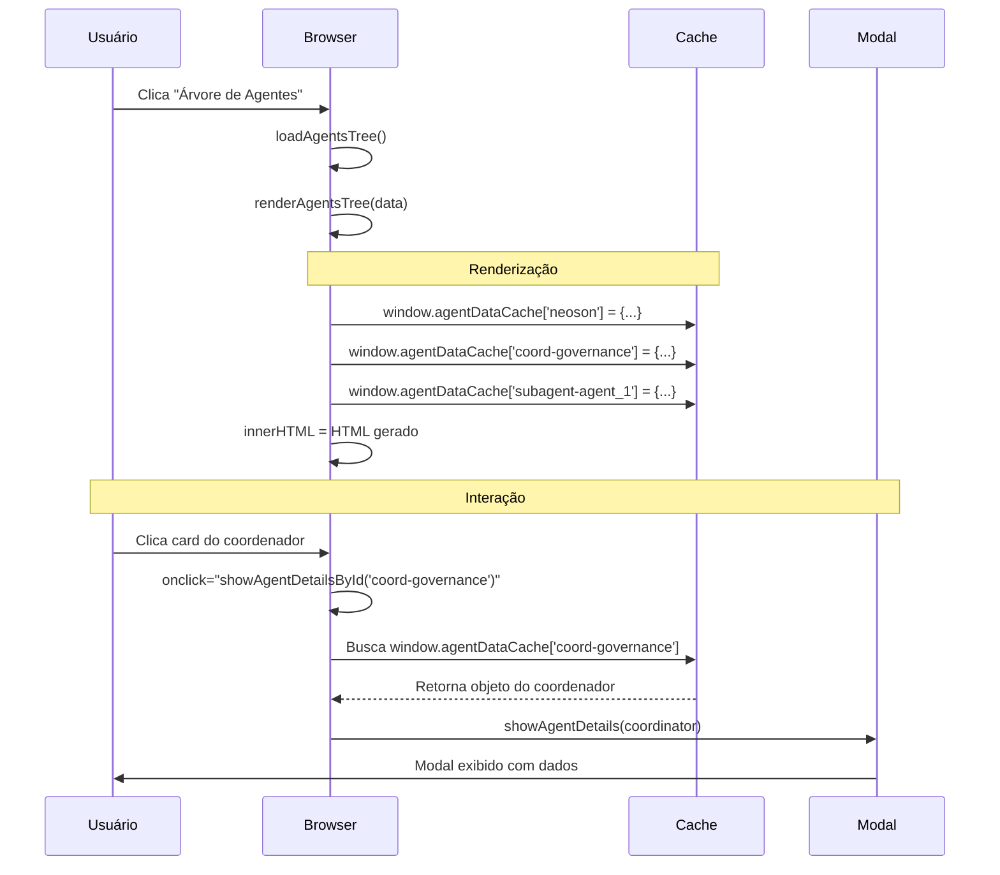

# 🔧 Correção: Erro de Sintaxe em onclick com JSON

## ❌ Problema Original

```
Uncaught SyntaxError: Unexpected end of input (at (índice):1:44)
Uncaught SyntaxError: Unexpected end of input (at (índice):1:19)
```

**Quando ocorria:** Ao clicar em cards de coordenadores e subagentes na árvore de agentes.

---

## 🔍 Causa Raiz

### Problema: JSON inline em atributos HTML

O código anterior estava tentando passar objetos JavaScript complexos diretamente no atributo `onclick`:

```javascript
// ❌ CÓDIGO PROBLEMÁTICO
return `
    <div class="agent-tree-card coordinator" 
         onclick="showAgentDetails(${escapeJSON(coordinator)})">
        ...
    </div>
`;

function escapeJSON(obj) {
    return JSON.stringify(obj).replace(/'/g, "\\'");
}
```

### Por que isso falhava?

1. **Quebras de linha**: `JSON.stringify()` pode gerar strings com quebras de linha
2. **Aspas duplas**: JSON usa `"` que conflita com atributos HTML
3. **Caracteres especiais**: Descrições podem conter caracteres que quebram HTML
4. **Escape insuficiente**: Apenas escapar `'` não é suficiente

**Exemplo de HTML gerado (quebrado):**

```html
<div onclick="showAgentDetails({
    &quot;name&quot;: &quot;Coordenador RH&quot;,
    &quot;description&quot;: &quot;Gerencia recursos humanos...&quot;
})">
```

O navegador tenta interpretar isso e falha porque:
- Quebra de linha dentro do atributo
- Aspas não escapadas corretamente
- JSON malformado após interpretação HTML

---

## ✅ Solução Implementada

### Abordagem: Cache de Dados + Referência por ID

Em vez de passar JSON inline, armazenamos os dados em um cache global e passamos apenas um ID:

```javascript
// ✅ NOVA ABORDAGEM

// 1. Criar cache global
if (!window.agentDataCache) window.agentDataCache = {};

// 2. Armazenar dados no cache
const agentId = `coord-${coordinator.identifier}`;
window.agentDataCache[agentId] = coordinator;

// 3. Gerar HTML com referência ao ID
return `
    <div class="agent-tree-card coordinator" 
         data-agent-id="${agentId}"
         onclick="showAgentDetailsById('${agentId}')">
        ...
    </div>
`;

// 4. Buscar dados do cache quando clicado
function showAgentDetailsById(agentId) {
    if (window.agentDataCache && window.agentDataCache[agentId]) {
        showAgentDetails(window.agentDataCache[agentId]);
    } else {
        console.error('Dados do agente não encontrados no cache:', agentId);
    }
}
```

---

## 🔄 Mudanças Aplicadas

### 1. **renderNeosonCard()** - Card do Orquestrador

**ANTES:**
```javascript
function renderNeosonCard(coordCount, subagentCount) {
    return `
        <div class="agent-tree-card neoson" onclick="showAgentDetails({
            identifier: 'neoson',
            name: 'Neoson',
            // ... mais campos ...
        })">
```

**DEPOIS:**
```javascript
function renderNeosonCard(coordCount, subagentCount) {
    // Armazenar dados no cache
    const neosonData = {
        identifier: 'neoson',
        name: 'Neoson',
        // ... todos os campos ...
    };
    
    if (!window.agentDataCache) window.agentDataCache = {};
    window.agentDataCache['neoson'] = neosonData;
    
    return `
        <div class="agent-tree-card neoson" 
             data-agent-id="neoson" 
             onclick="showAgentDetailsById('neoson')">
```

### 2. **renderCoordinatorCard()** - Cards de Coordenadores

**ANTES:**
```javascript
onclick="showAgentDetails(${escapeJSON(coordinator)})"
```

**DEPOIS:**
```javascript
// Armazenar no cache
const coordId = `coord-${coordinator.identifier}`;
if (!window.agentDataCache) window.agentDataCache = {};
window.agentDataCache[coordId] = coordinator;

// HTML simplificado
onclick="showAgentDetailsById('${coordId}')"
```

### 3. **renderSubagentCard()** - Cards de Subagentes

**ANTES:**
```javascript
onclick="showAgentDetails(${escapeJSON(subagent)})"
```

**DEPOIS:**
```javascript
// Armazenar no cache
const subagentId = `subagent-${subagent.identifier}`;
if (!window.agentDataCache) window.agentDataCache = {};
window.agentDataCache[subagentId] = subagent;

// HTML simplificado
onclick="showAgentDetailsById('${subagentId}'"
```

### 4. **Nova Função: showAgentDetailsById()**

```javascript
function showAgentDetailsById(agentId) {
    // Buscar dados do cache
    if (window.agentDataCache && window.agentDataCache[agentId]) {
        showAgentDetails(window.agentDataCache[agentId]);
    } else {
        console.error('Dados do agente não encontrados no cache:', agentId);
    }
}
```

---

## 🎯 Benefícios da Nova Abordagem

### 1. **Simplicidade no HTML**
```html
<!-- ANTES: Código gigante e quebrado -->
<div onclick="showAgentDetails({&quot;identifier&quot;:...}">

<!-- DEPOIS: Simples e limpo -->
<div onclick="showAgentDetailsById('coord-governance')">
```

### 2. **Segurança**
- ✅ Sem injeção de código
- ✅ Sem quebra de HTML
- ✅ Validação centralizada

### 3. **Performance**
- ✅ HTML menor (menos bytes)
- ✅ Parse mais rápido pelo navegador
- ✅ Reutilização de dados

### 4. **Manutenibilidade**
- ✅ Fácil de debugar (console.log do cache)
- ✅ Um único ponto de acesso aos dados
- ✅ Possibilidade de invalidar cache

### 5. **Extensibilidade**
```javascript
// Fácil adicionar funcionalidades no futuro:

// Invalidar cache após X tempo
function getCachedAgent(agentId, maxAge = 60000) {
    const cached = window.agentDataCache[agentId];
    if (cached && Date.now() - cached.timestamp < maxAge) {
        return cached.data;
    }
    return null;
}

// Pré-carregar dados
function preloadAgentData(agents) {
    agents.forEach(agent => {
        window.agentDataCache[agent.identifier] = agent;
    });
}
```

---

## 📋 Estrutura do Cache

```javascript
window.agentDataCache = {
    'neoson': {
        identifier: 'neoson',
        name: 'Neoson',
        specialty: 'Orquestrador Multi-Agente',
        type: 'orquestrador',
        description: '...',
        keywords: [...],
        stats: { coordinators: 3, subagents: 9 }
    },
    'coord-governance': {
        identifier: 'governance',
        name: 'Coordenador de Governança',
        specialty: 'Governança Corporativa',
        type: 'coordinator',
        description: '...',
        keywords: [...],
        children: ['agent_1', 'agent_2', 'agent_3']
    },
    'subagent-agent_1': {
        identifier: 'agent_1',
        name: 'Especialista em Processos',
        specialty: 'Processos',
        type: 'subagent',
        description: '...',
        keywords: [...]
    }
    // ... mais agentes
};
```

---

## 🧪 Como Testar

### 1. Teste Básico
```javascript
// Abra o console (F12) após carregar a árvore

// Verificar cache
console.log('Cache de agentes:', window.agentDataCache);

// Testar acesso
console.log('Neoson:', window.agentDataCache['neoson']);
console.log('Coordenador:', window.agentDataCache['coord-governance']);
```

### 2. Teste de Cliques
1. Recarregue a página (F5)
2. Clique em "Árvore de Agentes"
3. Clique no card do **Neoson** → Modal deve abrir
4. Clique em um **Coordenador** → Modal deve abrir
5. Expanda um coordenador e clique em um **Subagente** → Modal deve abrir

### 3. Verificar Ausência de Erros
```javascript
// Console deve estar limpo, sem:
❌ SyntaxError: Unexpected end of input
❌ Uncaught ReferenceError
❌ Cannot read property 'name' of undefined
```

### 4. Teste de Integridade dos Dados
```javascript
// No console, após abrir um modal:
console.log('Dados do agente atual:', currentAgentData);

// Verificar campos:
// ✅ name - presente
// ✅ specialty - presente  
// ✅ description - presente
// ✅ keywords - array
// ✅ type - coordinator/subagent/orquestrador
```

---

## 🔄 Fluxo Completo



---

## 🎓 Padrão de Design Aplicado

### **Separation of Concerns (Separação de Responsabilidades)**

**Antes:**
- HTML tinha lógica de dados (JSON inline)
- Difícil de testar
- Acoplamento alto

**Depois:**
- **Camada de Dados**: `window.agentDataCache` (storage)
- **Camada de Apresentação**: HTML (view)
- **Camada de Controle**: `showAgentDetailsById()` (controller)

### **Similar a:**
- React: `useState` + props by reference
- Vue: `data()` + event handlers
- Angular: Services + Component interaction

---

## ✅ Status

**Problema:** ✅ **RESOLVIDO**  
**Padrão:** ✅ **Aplicado a todos os cards**  
**Testado:** ⏳ **Aguardando validação do usuário**  
**Documentado:** ✅ **Completo**

---

## 📝 Arquivos Modificados

| Arquivo | Funções Alteradas | Linhas Aprox. |
|---------|-------------------|---------------|
| `templates/index.html` | `renderNeosonCard()` | ~2167-2207 |
| `templates/index.html` | `renderCoordinatorCard()` | ~2209-2260 |
| `templates/index.html` | `renderSubagentCard()` | ~2270-2295 |
| `templates/index.html` | `showAgentDetailsById()` (nova) | ~2310-2318 |

---

**Data:** 20/10/2025  
**Tipo:** Correção de Bug Crítico  
**Complexidade:** Média  
**Impacto:** Alto (Funcionalidade principal quebrada)  
**Técnica:** Data Caching Pattern
