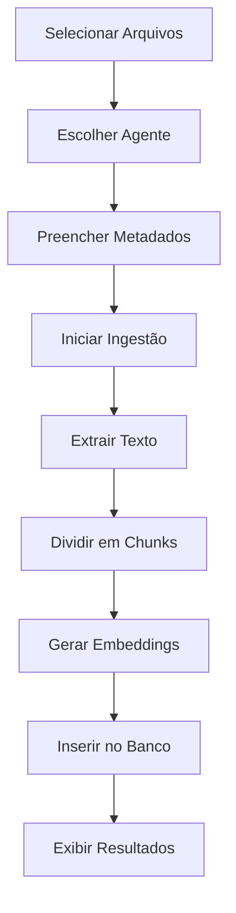

# 📚 Guia da Base de Conhecimento

## Visão Geral

A **Base de Conhecimento** é uma interface web que permite injetar documentos (PDFs e DOCX) nas tabelas de conhecimento dos agentes do sistema Neoson, substituindo a ferramenta desktop `ingest_data.py` com uma solução moderna e integrada.

---

## 🎯 Funcionalidades

### 1. **Upload de Documentos**
- **Formatos suportados**: PDF e DOCX
- **Métodos de upload**:
  - Drag-and-drop (arrastar e soltar)
  - Seleção via file picker (clique no botão)
- **Multi-arquivo**: Adicione múltiplos arquivos antes de processar

### 2. **Seleção de Agente**
Escolha qual agente receberá o conhecimento:
- Agentes de RH (3 tabelas)
- Agentes de TI (7 tabelas)
- Enterprise Apps (2 tabelas)
- CRM, Service Desk, Neoson

### 3. **Metadados de Governança**
Configure 12 campos de governança para cada documento:

| Campo | Descrição | Obrigatório |
|-------|-----------|-------------|
| **Áreas Liberadas** | Áreas que podem acessar (ex: RH, TI, ALL) | ✅ |
| **Geografias Liberadas** | Regiões geográficas (ex: BR, US, ALL) | ✅ |
| **Projetos Liberados** | Projetos específicos ou ALL | ✅ |
| **Nível Hierárquico Mínimo** | 1-5 (Estagiário a Executivo) | ✅ |
| **Idioma** | pt-br, en-us, es-es | ✅ |
| **Data de Validade** | Até quando o documento é válido | ❌ |
| **Responsável** | Nome do responsável pelo conteúdo | ❌ |
| **Aprovador** | Nome do aprovador | ❌ |
| **Dado Sensível** | Checkbox para dados confidenciais | ❌ |
| **Apenas Para SI** | Checkbox para uso exclusivo | ❌ |

### 4. **Log em Tempo Real**
Acompanhe o processamento de cada arquivo:
- 🔵 **INFO**: Etapas do processamento
- ✅ **SUCCESS**: Operações bem-sucedidas
- ⚠️ **WARNING**: Avisos importantes
- ❌ **ERROR**: Erros encontrados

---

## 🔄 Fluxo de Trabalho



### Passo a Passo:

1. **Adicione Arquivos**
   - Clique em "Selecionar Arquivos" ou arraste arquivos para a área de upload
   - Apenas PDFs e DOCX serão aceitos

2. **Configure o Destino**
   - Selecione o agente que receberá o conhecimento
   - Preencha os metadados de governança

3. **Inicie o Processamento**
   - Clique em "Iniciar Ingestão"
   - Aguarde o processamento (pode demorar para arquivos grandes)

4. **Verifique os Resultados**
   - Acompanhe o log em tempo real
   - Veja estatísticas ao final:
     - Tamanho do texto extraído
     - Número de chunks gerados
     - Embeddings criados
     - Registros inseridos no banco

---

## 🧮 Parâmetros Técnicos

### Chunking (Divisão de Texto)
- **Tamanho do chunk**: 1000 caracteres
- **Overlap**: 150 caracteres
- **Método**: RecursiveCharacterTextSplitter (LangChain)

### Embeddings
- **Modelo**: OpenAI text-embedding-3-small
- **Dimensões**: 1536
- **Batch size**: 100 chunks por requisição

### Extração de Texto
- **PDF**: pypdf (com fallback OCR)
- **DOCX**: python-docx
- **OCR**: pytesseract + pdf2image (para PDFs escaneados)

---

## 📊 Tabelas de Agentes Disponíveis

### 🧑‍💼 Recursos Humanos
- `rh_benefits_knowledge` - Benefícios
- `rh_payroll_knowledge` - Folha de Pagamento
- `rh_recruitment_knowledge` - Recrutamento

### 💻 Tecnologia da Informação
- `it_infrastructure_knowledge` - Infraestrutura
- `it_network_knowledge` - Redes
- `it_security_knowledge` - Segurança
- `it_storage_knowledge` - Armazenamento
- `it_database_knowledge` - Bancos de Dados
- `it_monitoring_knowledge` - Monitoramento
- `it_cloud_knowledge` - Cloud

### 🏢 Enterprise Applications
- `enterprise_erp_knowledge` - ERP
- `enterprise_bi_knowledge` - Business Intelligence

### 🎯 Outros Agentes
- `crm_knowledge` - CRM (Gestão de Relacionamento)
- `service_desk_knowledge` - Service Desk (Suporte)
- `neoson_knowledge` - Conhecimento Geral Neoson

---

## 🔐 Segurança e Governança

### Controle de Acesso
- **Áreas**: Limite o conhecimento a departamentos específicos
- **Geografias**: Restrinja por região (LGPD/GDPR compliance)
- **Nível Hierárquico**: Garanta que apenas níveis apropriados vejam dados sensíveis

### Dados Sensíveis
- Marque a checkbox "Dado Sensível" para:
  - Dados financeiros confidenciais
  - Informações pessoais (PII)
  - Estratégias de negócio
  - Dados regulamentados

### Rastreabilidade
- Todos os documentos têm:
  - Nome do arquivo original
  - Responsável pelo upload
  - Aprovador (se aplicável)
  - Data de validade
  - Timestamp de inserção

---

## 🚀 Como Usar

### 1. Acesse a Página
```
Sidebar → Base de Conhecimento
```

### 2. Exemplo de Uso

**Cenário**: Adicionar política de férias do RH

```
1. Upload: "politica_ferias_2024.pdf"
2. Agente: "Agente RH - Benefícios"
3. Metadados:
   - Áreas: RH
   - Geografias: BR
   - Projetos: ALL
   - Nível: 1 (Todos)
   - Idioma: pt-br
   - Responsável: João Silva
   - Aprovador: Maria Santos
   - Dado Sensível: ❌
4. Clicar em "Iniciar Ingestão"
5. Aguardar processamento
6. Verificar log de sucesso
```

### 3. Resultado Esperado

```
✅ Arquivo: politica_ferias_2024.pdf
  → Enviando arquivo para o servidor...
  → Texto extraído: 4523 caracteres
  → Chunks gerados: 5
  → Embeddings criados: 5
  → Inseridos no banco: 5

✅ Ingestão concluída com sucesso!
   Total de documentos processados: 1
   Total de chunks inseridos: 5
```

---

## 🛠️ Troubleshooting

### ❌ Erro: "Não foi possível extrair texto"
**Causa**: PDF escaneado ou corrompido  
**Solução**: 
- Certifique-se de que pytesseract está instalado
- Verifique se o PDF não está corrompido
- Tente reexportar o PDF com texto selecionável

### ❌ Erro: "Nenhum embedding gerado"
**Causa**: Problema na API OpenAI ou chunks vazios  
**Solução**:
- Verifique a API key da OpenAI
- Certifique-se de que o texto foi extraído corretamente
- Verifique se há créditos na conta OpenAI

### ❌ Erro: "Erro ao inserir no banco"
**Causa**: Problema de conexão ou permissões no PostgreSQL  
**Solução**:
- Verifique a string de conexão DATABASE_URL
- Certifique-se de que a tabela existe
- Verifique permissões de INSERT

### ⚠️ Aviso: "Alguns chunks falharam"
**Causa**: Chunks muito pequenos ou com caracteres especiais  
**Solução**: 
- Normal para documentos com formatação complexa
- Os chunks válidos ainda serão inseridos
- Revise o log para ver quais falharam

---

## 📈 Boas Práticas

### 1. **Nomeação de Arquivos**
Use nomes descritivos:
- ✅ `politica_ferias_2024_v2.pdf`
- ❌ `documento.pdf`

### 2. **Organização por Áreas**
Agrupe documentos similares:
- Políticas de RH → Agente RH correspondente
- Manuais técnicos → Agente TI correspondente
- Processos de vendas → CRM

### 3. **Atualização de Conteúdo**
Para atualizar documentos:
1. Adicione nova versão com data no nome
2. Use Data de Validade no documento antigo
3. Ou remova manualmente o documento antigo do banco

### 4. **Metadados Consistentes**
Mantenha padrões:
- Use sempre os mesmos códigos de área (RH, TI, FIN)
- Mantenha lista de projetos atualizada
- Documente responsáveis e aprovadores

---

## 🔍 Verificação de Dados

### Query SQL para Verificar Inserções

```sql
-- Ver últimos documentos inseridos
SELECT 
    fonte_documento,
    COUNT(*) as total_chunks,
    areas_liberadas,
    nivel_hierarquico_minimo,
    responsavel,
    created_at
FROM rh_benefits_knowledge
GROUP BY fonte_documento, areas_liberadas, nivel_hierarquico_minimo, responsavel, created_at
ORDER BY created_at DESC
LIMIT 10;
```

### Query para Busca Semântica

```sql
-- Buscar conhecimento similar
SELECT 
    conteudo_original,
    fonte_documento,
    cosine_similarity(vetor, query_vector) as similarity
FROM rh_benefits_knowledge
ORDER BY vetor <-> query_vector
LIMIT 5;
```

---

## 🎓 Referências

- **Código Original**: `ingest_data/ingest_data.py`
- **API Endpoint**: `/api/knowledge/ingest`
- **Frontend JS**: `static/knowledge.js`
- **Backend Logic**: `api_knowledge.py`

---

## 📞 Suporte

Para problemas ou dúvidas:
1. Verifique o log em tempo real
2. Consulte a seção Troubleshooting
3. Revise os logs do servidor (console do uvicorn)
4. Entre em contato com o time de desenvolvimento

---

**Versão**: 1.0  
**Última Atualização**: 2024  
**Status**: ✅ Produção
